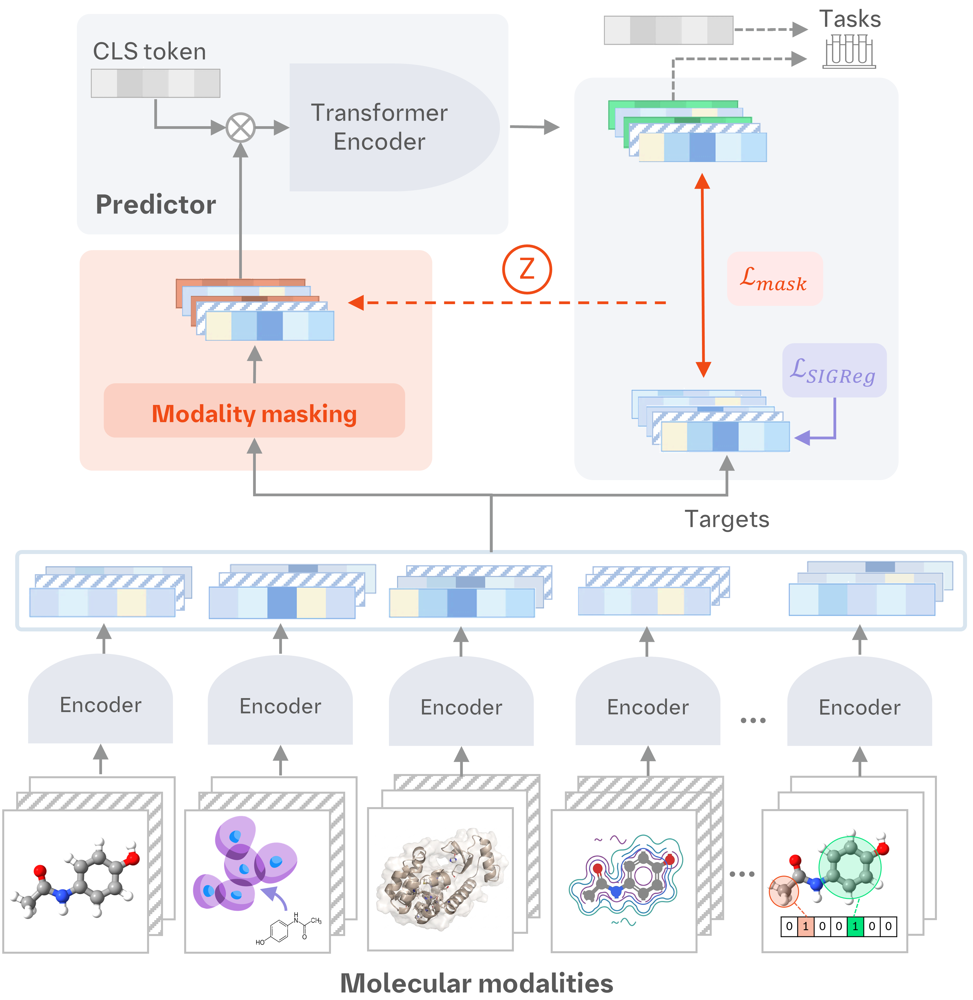

<div align="center">

# Mol-JEPA -  A multimodal Joint Embedding Predictive Architecture for Molecules

This is the code for Mol-JEPA, a scalable framework for learning molecular world models from diverse 
physical and biochemical modalities that go beyond the molecular structure. Using a novel multi-modal
joint embedding predictive architecture, we efficiently fuse information from various pretrained
models and datasets, including cellular effects, binding affinity, ADMET properties and quantum
chemistry. Across relevant benchmarks, we show that the representations learned by Mol-JEPA
achieve competitive performance, marking an important step towards more comprehensive molecular
foundation models. 


📄 [Paper](LINK) | 🤗 [Model](https://huggingface.co/Flogrammer/Mol-JEPA) | 🤗 [Dataset](https://huggingface.co/datasets/Flogrammer/Mol-JEPA-dataset)




<div align="left">


***
## Basic usage
The easiest way to use Mol-JEPA is through Huggingface, which provides the model checkpoint with an inference module for batching. 
First install the required libraries:
```bash 
pip install torch torch-geometric transformers safetensors rdkit molfeat numpy
```

Then you can generate embedding vectors as follows. Mol-JEPA provides three outputs: the CLS token as global summary, per-modality predicted embeddings
and per-modality latent embeddings before the readout layer. The inference module expects a list of smiles, which will be processed as a batch.

```python
from transformers import AutoModel

model = AutoModel.from_pretrained("Flogrammer/Mol-JEPA", trust_remote_code=True)
model.eval()

smiles_list = ["Cn1cnc2n(C)c(=O)n(C)c(=O)c12", "CC(=O)Oc1ccccc1C(=O)O"]
out = model(smiles_list)

print("Predicted embeddings shape:", out.predictions.shape) # batch size, modalities, embedding dimension
>>> Predicted embeddings shape: torch.Size([2, 12, 512])

print("CLS token shape:", out.cls.shape) # batch size, embedding dimension
>>> CLS token shape: torch.Size([2, 512])

print("Latent embeddings shape:", out.embeddings.shape) # batch size, modalities (+ CLS), latent dimension
>>> Latent embeddings shape: torch.Size([2, 13, 512])
```


## Training

### Data
The multimodal dataset is available on huggingface and can be loaded as described below.
In contains a metadata table that links SMILES / InChi codes to the modalities, which are stored in numpy arrays. **Note that the full dataset has a size of 313 GB when unzipped.**

```
from datasets import load_dataset

metadata = load_dataset("Flogrammer/Mol-JEPA-dataset")
metadata.head()
```

### Setup
You can also train your own model and add additional modalities. The overall training logic is based on the stable-pretraining library and config files control most of the important properties. The config used by the Huggingface model can be found here: `src/config/moljepa.yaml`.

Install the `requirements.txt` for model training and then simply launch the training by
```
train.py --config-name=moljepa
```
For more advanced options see the `train.bash` script which parallelizes training on multiple GPUs using SLURM. 


### Adding modalities
Our framework allows to easily add additional modalities. The base class is defined in `src/models/backbones/base.py` and specifies the required functions for a new modality module. In the same directory you can find several examples for modality definitions. On one hand, we support different backbone types:
- Graph-Encoders (GNN-type output)
- Embedding-Encoders (2D embedding)
- Atom-Encoders (Node features without connectivity)

and secondly, they can be:
- Precomputed (embeddings constructed outside of Mol-JEPA training)
- Processed in parallel (i.e. using all available workers to iterate over metadata table)
- Processed using batch dimension (i.e. pass multiple samples at once through Encoder)

The metadata table name serves as a unique identifier and all processed modalities will be stored as tensors on the disk, to avoid re-processing them on every training launch. The code will automatically check if new modalities were added and only processes those. 

To use new modalities, simply add them to the `modalities` field in the config file. For this you need to specify a few properties, for example if the modality has been pre-computed or its dimensionality. All samples are stored as tensor files on disk once processed. Also make sure a path-column in the metadata table exists.

```yaml
# Example 1
- name: uma # Modality name
  input: precomputed_node # Atom-level precomputed
  output: atoms # the output shape. atoms means [n_atoms, n_features]
  colname: uma_embedding_path # The column name in the metadata table
  node_dim: 128 # dimensionality of the node features
  processing: multiprocess # batch size = 1 but multiple workers

# Example 2
- name: ecfp # Modality name
  input: smiles # Here the backbone module expectes a smiles string as input
  output: embedding # shape [1, dim]
  dim: 2048 # embedding dimension
  processing: batch # the module allows batch processing
  batch_size: 64 # Batch size for processing
```

**At the moment, Mol-JEPA only supports static modalities, i.e. we have no option to include learnable encoders.** 


### Online probes and callbacks
During training, several callbacks from stable-pretraining are used to monitor the training. For example, different online probes can be defined in the yaml file, which will be displayed on tensorboard during training. Stable-pretraining uses separate optimizer loops for those. More useful callbacks are available in `src/callbacks`, for example Early Stopping, Gradient tracing, UMAP visualizations and more. 


### Hyperparameter tuning
We also provide an example yaml and bash script to perform parallel bayesian hyperparameter tuning using SLURM and Optuna, which can be found at `config/moljepa_hp.yaml`. The hyperparameter search will automatically log all important information to tensorboard and allows to quickly compare different configurations.

## Attention
For attention analysis, you can capture and optionally return the Transformer self-attention maps during inference. For this, simply pass `return_attn=False` in the model forward pass (also works for the Huggingface model) and it will return one tensor per layer with shape `[batch, heads, n_modalities, n_modalities]`.


## Evaluation Notebooks
Our plots and results can be generated using the following notebooks. Below you find a brief summary of each notebook's content. 
- 01_data_pipeline: Contains the processing code to create the full dataset
- 02_embedding_analysis: UMAP visualization of modality representations and CKA comparison
- 03_downstream_prediction: Cross-validation and public split evaluation and downstream training

To run the notebooks, you als need to set these several environment variables, such as:
```bash
export PROCESSED_DIR="/path/to/processed/data"
export BENCHMARKS_DIR="/path/to/benchmark/results"
export CHECKPOINT_DIR="/path/to/checkpoint/files"
export LOGS_DIR="/path/to/tensorboard/logs"
export CLUSTER_SPLITS_DIR="/path/to/split/files"
```

## Citation

If you use MOL-JEPA in your research, please cite:

```bibtex
@article{moljepa,
  title   = {MOL-JEPA: A Multimodal Joint Embedding Predictive Architecture for Molecules},
  author  = {Rottach, Florian and Schieferdecker, Sebastian and Rudman, William and Balestriero, Randall and Eickhoff, Carsten},
  journal = {arXiv preprint},
  year    = {XXXX},
  note    = {Manuscript in preparation},
  affiliation = {University of T{\"u}bingen; Boehringer Ingelheim; The University of Texas at Austin; Brown University}
}
```

## License
This repository, including the model, source code, documentation, and associated materials, is licensed under the **Creative Commons Attribution-NonCommercial 4.0 International (CC BY-NC 4.0)** License.

You are free to share, copy, redistribute, adapt, and modify this work for **non-commercial purposes**, provided that appropriate credit is given to the original author(s), a link to the license is included, and any changes made are clearly indicated.

**Commercial use is not permitted** without prior written permission from the author(s).

For the full license text, see: https://creativecommons.org/licenses/by-nc/4.0/